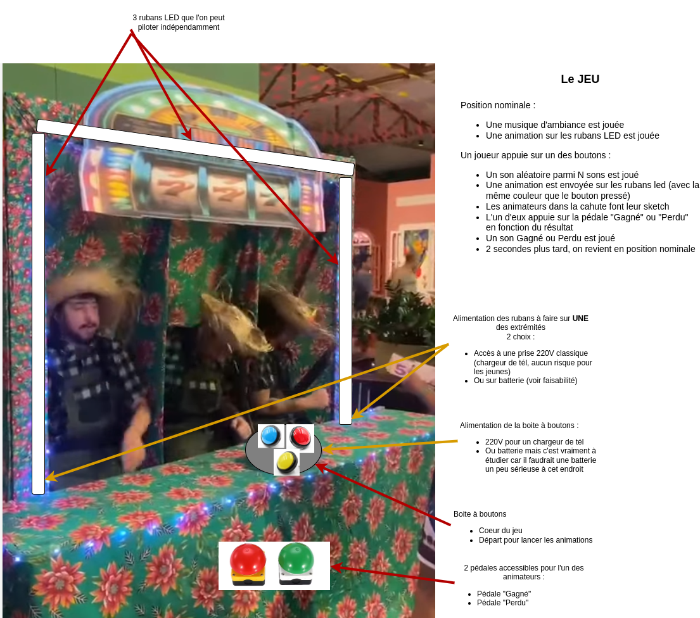
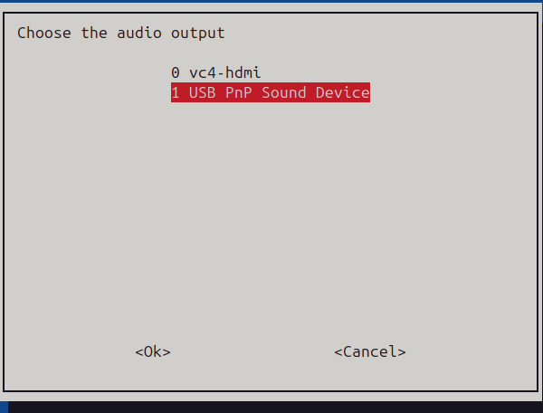

# Alegria 777 game like

## Contexte

Il s'agit d'un jeu de 777 "humain" avec quelques effets lumineux et sonores.  



## Fonctionnement du jeu

* Boite à boutons + animations sonores et LED.

## Architecture

* Raspberry pi 0 2w pour le programme principal + gestion du son
* ESP32 Wled pour piloter les rubans LED

### Hardware

| Item                         | Photo                                          | Description |
| ---------------------------- | ---------------------------------------------- | ----------- |
| Raspberry pi 2 W             |  | Carte principale |
| Carte son USB                |       | Le Pi 0 ne spossède pas de carte intégrée |
| Cable micro USB              |               | Convertisseur Micro USB -> USB A femelle  |
| Boutons jeu                  | | |
| Boutons pédale               | | |
| Connecteurs Jack 3,5mm       | | |
| Connecteur alimentation      | | |
| Cable jack 3,5mm mâle mâle   | | |
| ESP32                        | | |
| Rubans LED                   | | |
| Boite en bois 40x20x10 cm    | | |


## Montage

### Boite à boutons

| Bouton        | GPIO | Fonction                                                     |
| ------------- | ---- | ------------------------------------------------------------ |
| Rouge         | 17   | Déclenchement d'une animation WLED rouge + sons associés     |
| Bleu          | 4    | Déclenchement d'une animation WLED bleue + sons associés     |
| Jaune         | 27   | Déclenchement d'une animation WLED jaune + sons associés     |
| Pédale Succès | ??   | Déclencement d'une animation WLED de succès + sons associés  |
| Pédale Echec  | ??   | Déclencement d'une animation WLED d'echec  + sons associés   |

## Logiciels

### Système

* OS Raspberry pi OS 64 bits sans desktop 
* Sélection de la carte son USB via raspi-config



### Réseau

Le raspberry pi 0 met à disposition un access point sur lequel l'ESP32 se connecte.  
Cela permet à l'ensemble de fonctionner sans pré-requis sur place.  
Le SSID monté par le RPI est : "banditmanchot" mais il est caché. 

```sh
sudo apt update
sudo apt install hostapd dnsmasq
```

**hostap**

```
$ cat /etc/hostapd/hostapd.conf 
interface=wlan0
driver=nl80211
ssid=banditmanchot
hw_mode=g
channel=7
wmm_enabled=0
macaddr_acl=0
auth_algs=1
ignore_broadcast_ssid=0
wpa=2
wpa_passphrase=JesusrevientparmilessienS
wpa_key_mgmt=WPA-PSK
wpa_pairwise=TKIP
rsn_pairwise=CCMP
ignore_broadcast_ssid=1
```

**dnsmasq**

```
interface=wlan0
dhcp-range=192.168.147.2,192.168.147.5,255.255.255.0,24h
```

```
sudo systemctl enable hostapd dnsmasq
sudo systemctl start hostapd dnsmasq
```

### Programme principal sur le raspberry

**Installation**

```
sudo apt install git python3-yaml python3-pip python3-gpiozero python3-pygame
```

```
sudo cp contrib/alegria.service /etc/systemd/system/
sudo chmod 644 /etc/systemd/system/alegria.service 
sudo systemctl daemon-reload
sudo systemctl enable alegria.service
sudo systemctl start alegria.service
```


### Image WLED sur l'ESP32

L'image a été déployée depuis l'installeur web fourni par WLED.  

L'ensemble des presets est disponible dans le répertoire [wled_presets](./wled_presets).  
